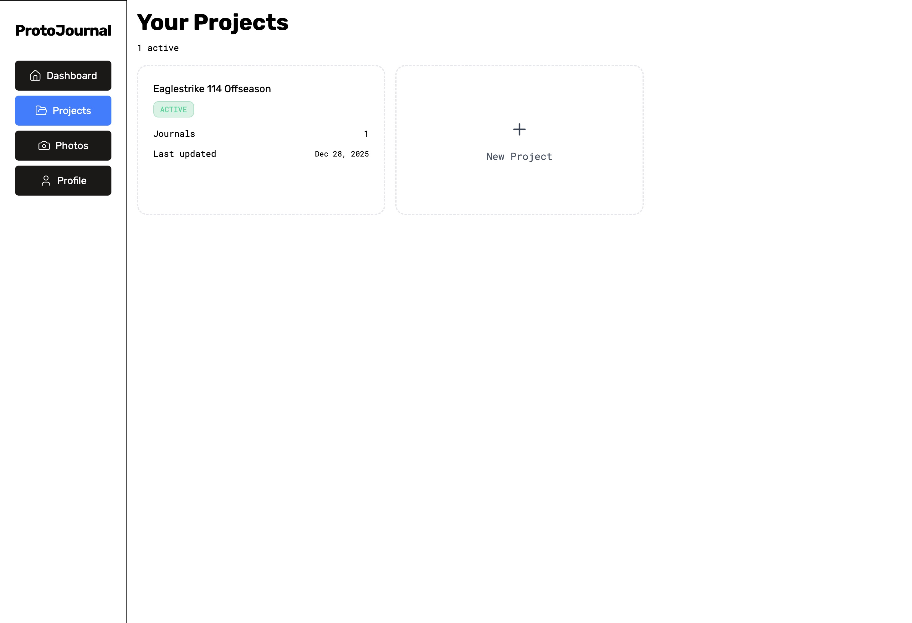
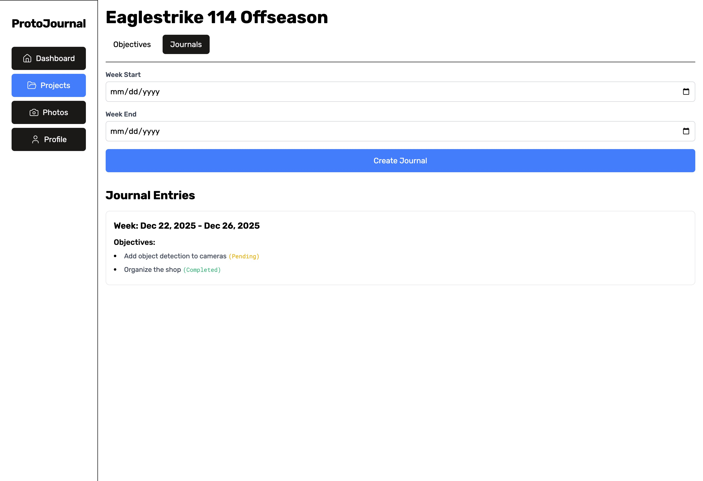
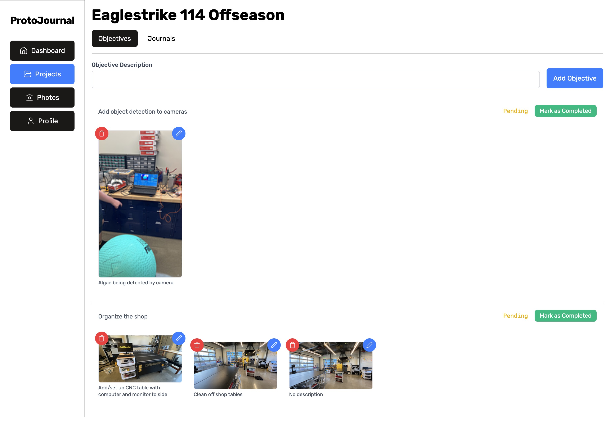
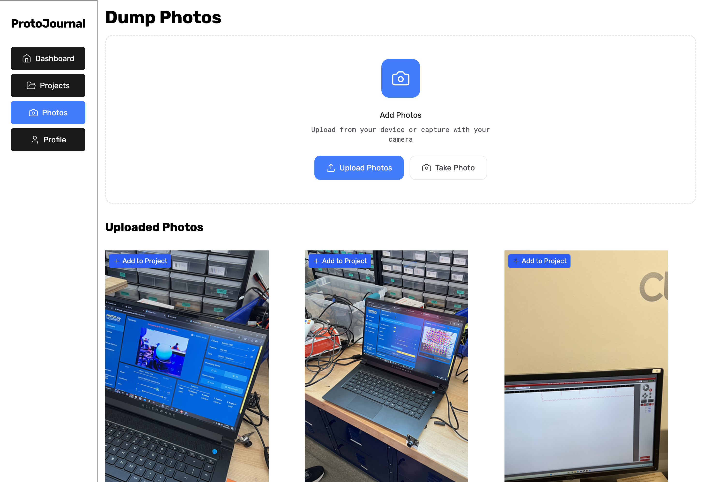

# Protojournal

Protojournal is designed for you to keep track of progress on your projects. Set weekly objectives and attach photos to
show your progress towards completing each objective. Then, at the end of the
week, you reflect on your progress. This is a great way to visualize how your project is progressing and document your
processes for future reference.

The methodology of documenting is highly inspired by my school robotics class's "weekly
report" system.

> [!NOTE]
> Access protojournal online at [protojournal.alaninnovates.com](http://protojournal.alaninnovates.com)

## Features/Screenshots

<table>
    <tr>
        <td>
            Make and list out your projects 
            
        </td>
        <td>
            Create a weekly journal 
            
        </td>
    </tr>
    <tr>
        <td>
            Create objectives for the weekly 
            
        </td>
        <td>
            Dump photos and associate them with objectives 
            
        </td>
    </tr>
    <tr>
        <td>
            Reflect on your weekly progress 
            
        </td>
    </tr>
</table>

It's that simple! Plus, you can easily dump photos and associate them with objectives later to make your life easier.
